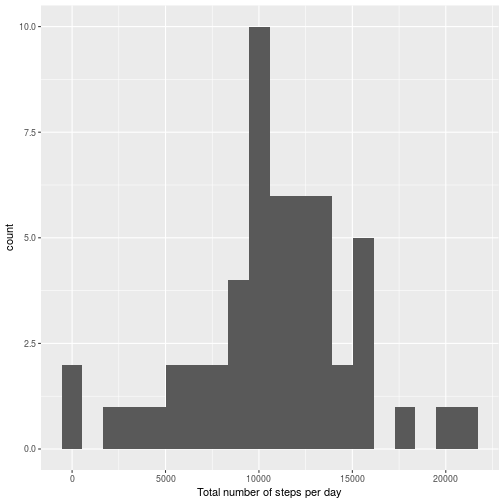
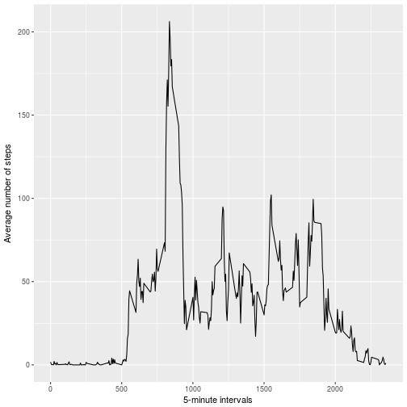
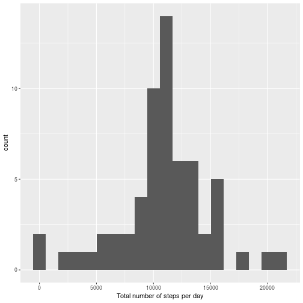
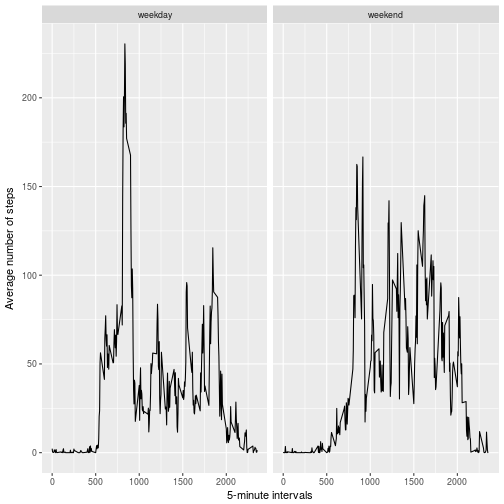

## Loading and preprocessing the data

First we'll read in the dataset.


```r
data <- read.csv('activity.csv')
```

In the various analyses we will make use of the ggplot2 and dplyr packages.


```r
library(dplyr)
library(ggplot2)
```

## What is mean total number of steps taken per day?

We first make a histogram of the total number of steps taken each day, ignoring any missing values (encoded as NA).


```r
totalstable <- data %>% filter(!is.na(steps)) %>% group_by(date) %>% summarise( totals=sum(steps)) 
qplot(data=totalstable, totals, geom = 'histogram', xlab = 'Total number of steps per day', bins= 20)
```



Furthermore, we compute the mean and median total number of steps per day.


```r
mean <- mean(totalstable$totals)
median <- median(totalstable$totals)
```

The computed mean is `1.0766189 &times; 10<sup>4</sup>`, and the median is `10765`.

## What is the average daily activity pattern?
 
Next we compute the number of steps taken in each time interval averaged over the days, again removing missing values. Then we make a timeplot of these averages.


```r
intervalmeans <- data %>% filter(!is.na(steps)) %>% group_by(interval) %>% summarise( means= mean(steps)) 
qplot(data= intervalmeans, interval, means, xlab = '5-minute intervals', ylab = 'Average number of steps', geom = 'line')
```



Next, we determine which 5-minute interval has the maximum number of steps taken (averaged over the days).


```r
maxinterval <- intervalmeans$interval[which.max(intervalmeans$means)]
```

The interval with the maximum number of steps taken is `835`, which we see indeed seems to correspond to the peak in our timeplot.

## Imputing missing values
As we will now check there are several missing values in the data set.


```r
sum(is.na(data$steps))
```

```
## [1] 2304
```

We will create a new data set where we replace missing values with the mean value of that time interval


```r
newdata <- data
for(i in 1:length(newdata$steps)){
        if(is.na(newdata$steps[i])){
                currentint <- newdata$interval[i]
                whichmean <- intervalmeans$interval == currentint
                newdata$steps[i] <- intervalmeans$means[whichmean]
        }
}
```

Note that there are no time intervals without an assigned mean value, as we can easily verify.


```r
length(unique(data$interval)) == length(intersect(data$interval,intervalmeans$interval))
```

```
## [1] TRUE
```

```r
sum(is.na(newdata$steps))
```

```
## [1] 0
```

Now we again make a histogram and compute mean and median total numbers of steps. 


```r
newtotalstable <- newdata %>% filter(!is.na(steps)) %>% group_by(date) %>% summarise( totals=sum(steps)) 
qplot(data=newtotalstable, totals, geom = 'histogram', xlab = 'Total number of steps per day', bins= 20)
```



```r
mean(newtotalstable$totals)
```

```
## [1] 10766.19
```

```r
median(newtotalstable$totals)
```

```
## [1] 10766.19
```

Because of our method of replacing missing values the mean stayed the same, whereas we see that the median has changed to become the mean (due to whole days being NA which will get assigned the mean value). The histogram also changed, with more measurements around 11.000 steps a day.

## Are there differences in activity patterns between weekdays and weekends?

To see if there is a difference in activity patterns between weekdays and weekends we will create a new factor variable describing where the activity took place during a weekday or a weekend.


```r
newdata <- mutate(newdata, day = weekdays(as.Date(date)))
for(i in 1:length(newdata$day)){
        if( newdata$day[i] %in% c('Monday','Tuesday','Wednesday','Thursday','Friday')){
                newdata$day[i] <- 'weekday'
        }
        else{
                newdata$day[i] <- 'weekend'
        }
}
```

Finally we create a panel plot of time series plot, weekdays versus weekend days, of the average number of steps taken per 5-minute interval.


```r
summarytable <- newdata %>% group_by(interval, day) %>% summarise(means = mean(steps)) 
qplot( data= summarytable, interval, means, xlab= '5-minute intervals', ylab = 'Average number of steps', geom = 'line', facets = .~day)
```



So it seems there is a higher peak of activity during weekdays (mornings?) whereas the peak is missing on weekdays, but there is more movement overall.
